# Polymarket 智能合约架构总览

## 1. 模块架构总图

```mermaid
flowchart TB
    %% ═══════════════════════════════════════════════════════════════
    %% 外部系统 (Polygon 链外)
    %% ═══════════════════════════════════════════════════════════════
    subgraph External[" 外部系统 "]
        direction LR
        User["👤 用户 EOA/Safe"]
        Relayer["🔧 Polymarket Relayer<br/>━━━━━━━━━━━━━<br/>• 批量提交交易<br/>• 代付 Gas"]
        OffchainOB["📋 链下 Order Book<br/>━━━━━━━━━━━━━<br/>• 订单撮合<br/>• 价格发现"]
    end

    %% ═══════════════════════════════════════════════════════════════
    %% Polygon 链上
    %% ═══════════════════════════════════════════════════════════════
    subgraph Polygon["⛓️ Polygon PoS 链上合约"]
        
        %% ─────────────────────────────────────────
        %% 第三方基础设施
        %% ─────────────────────────────────────────
        subgraph ThirdParty["第三方合约 (非 Polymarket)"]
            direction LR
            USDC["💵 USDC<br/>━━━━━━━━━━━━━<br/>ERC20 抵押品<br/>0x2791Bca1f2de..."]
            UMA_OO["🔮 UMA OO V2<br/>━━━━━━━━━━━━━<br/>Optimistic Oracle<br/>争议期 2h → DVM"]
            GnosisSafe["🔐 Gnosis Safe<br/>━━━━━━━━━━━━━<br/>多签钱包框架"]
        end

        %% ─────────────────────────────────────────
        %% 钱包工厂层
        %% ─────────────────────────────────────────
        subgraph WalletLayer["📁 钱包工厂层"]
            SafeFactory["SafeProxyFactory<br/>━━━━━━━━━━━━━━━━━━━━━<br/>⚡ createProxy(sig) → Safe<br/>⚡ computeProxyAddress(user)<br/>━━━━━━━━━━━━━━━━━━━━━<br/>📤 OUT: Gnosis Safe 实例"]
            
            ProxyFactory["ProxyWalletFactory<br/>━━━━━━━━━━━━━━━━━━━━━<br/>⚡ proxy(calls[]) 批量执行<br/>⚡ makeWallet() Create2 克隆<br/>⚡ setGSNModule() [Owner]<br/>━━━━━━━━━━━━━━━━━━━━━<br/>📤 OUT: ProxyWallet 实例<br/>🔧 GSN 代付 Gas"]
        end

        %% ─────────────────────────────────────────
        %% 交易层 (用户主要交互入口)
        %% ─────────────────────────────────────────
        subgraph ExchangeLayer["💱 交易层 (核心入口)"]
            CTFExchange["CTFExchange<br/>0x4bFb41d5B3570DeFd03C39...<br/>━━━━━━━━━━━━━━━━━━━━━━━━━━━<br/>📥 IN: Order + Signature<br/>━━━━━━━━━━━━━━━━━━━━━━━━━━━<br/>⚡ fillOrder(order, amt) [Operator]<br/>⚡ fillOrders(orders[], amts[]) [Operator]<br/>⚡ matchOrders(taker, makers[]) [Operator]<br/>    ├─ COMPLEMENTARY: YES↔USDC<br/>    ├─ MINT: 2买单→split<br/>    └─ MERGE: 2卖单→merge<br/>⚡ cancelOrder(order) [Maker]<br/>⚡ incrementNonce() [User]<br/>⚡ registerToken(tokenId) [Admin]<br/>━━━━━━━━━━━━━━━━━━━━━━━━━━━<br/>📤 OUT: OrderFilled/Matched 事件"]

            NegRiskExchange["NegRiskCtfExchange<br/>0xC5d563A36AE78145C45a50...<br/>━━━━━━━━━━━━━━━━━━━━━━━━━━━<br/>继承 CTFExchange 全部接口<br/>━━━━━━━━━━━━━━━━━━━━━━━━━━━<br/>🔧 构造时授权 NegRiskAdapter<br/>🔧 多选市场专用"]
            
            FeeModule["FeeModule<br/>━━━━━━━━━━━━━━━━━━━━━━━━━━━<br/>📥 IN: matchOrders 参数<br/>━━━━━━━━━━━━━━━━━━━━━━━━━━━<br/>⚡ matchOrders(...) [Admin]<br/>    └─ 代理调用 + 退还多付费<br/>⚡ withdrawFees(to, tokenId, amt)<br/>━━━━━━━━━━━━━━━━━━━━━━━━━━━<br/>📤 OUT: refund = order.fee - actual"]
        end

        %% ─────────────────────────────────────────
        %% 核心资产层
        %% ─────────────────────────────────────────
        subgraph CoreLayer["🎯 核心资产层"]
            CTF["ConditionalTokens (Gnosis)<br/>0x4D97DCd97eC945f40cF65...<br/>━━━━━━━━━━━━━━━━━━━━━━━━━━━<br/>📥 IN: collateral, conditionId, partition<br/>━━━━━━━━━━━━━━━━━━━━━━━━━━━<br/>⚡ prepareCondition(oracle, qId, slots)<br/>    └─ → conditionId<br/>⚡ splitPosition(col, parent, cond, part, amt)<br/>    └─ USDC → YES + NO<br/>⚡ mergePositions(col, parent, cond, part, amt)<br/>    └─ YES + NO → USDC<br/>⚡ redeemPositions(col, parent, cond, sets)<br/>    └─ 结算后赎回<br/>⚡ reportPayouts(qId, payouts[]) [Oracle Only]<br/>━━━━━━━━━━━━━━━━━━━━━━━━━━━<br/>📤 OUT: ERC1155 positionId<br/>📦 STATE: payoutNumerators[cond]<br/>📦 STATE: payoutDenominator[cond]"]

            NegRiskAdapter["NegRiskAdapter<br/>0xd91E80cF2E7be2e162c651...<br/>━━━━━━━━━━━━━━━━━━━━━━━━━━━<br/>📥 IN: marketId, conditionId, amount<br/>━━━━━━━━━━━━━━━━━━━━━━━━━━━<br/>⚡ prepareMarket(feeBips, data) [Admin]<br/>⚡ prepareQuestion(mktId, data) [Admin]<br/>⚡ splitPosition(condId, amt) [User]<br/>⚡ mergePositions(condId, amt) [User]<br/>⚡ convertPositions(mktId, indexSet, amt)<br/>    └─ 🔥 负风险转换: 多NO→USDC<br/>⚡ reportOutcome(qId, outcome) [Oracle]<br/>━━━━━━━━━━━━━━━━━━━━━━━━━━━<br/>📤 OUT: 转换后 USDC/代币"]

            WrappedCol["WrappedCollateral<br/>━━━━━━━━━━━━━━━━━━<br/>📥 IN: USDC amount<br/>━━━━━━━━━━━━━━━━━━<br/>⚡ wrap(amt) USDC→WCOL<br/>⚡ unwrap(amt) WCOL→USDC<br/>━━━━━━━━━━━━━━━━━━<br/>📤 OUT: WCOL ERC20<br/>🔗 underlying = USDC"]
        end

        %% ─────────────────────────────────────────
        %% 预言机层
        %% ─────────────────────────────────────────
        subgraph OracleLayer["🔮 预言机层"]
            UmaAdapter["UmaCtfAdapter<br/>━━━━━━━━━━━━━━━━━━━━━━━━━<br/>📥 IN: questionId, ancillaryData<br/>━━━━━━━━━━━━━━━━━━━━━━━━━<br/>⚡ initialize(data, token, reward, bond, live)<br/>    └─ 创建问题<br/>⚡ ready(qId) → bool [View]<br/>⚡ resolve(qId) [Anyone]<br/>    └─ OO→CTF.reportPayouts<br/>⚡ flag(qId) [Admin]<br/>⚡ resolveManually(qId, payouts[]) [Admin]<br/>⚡ reset(qId) [Admin]<br/>━━━━━━━━━━━━━━━━━━━━━━━━━<br/>📤 OUT: payouts [1,0]/[0,1]/[0.5,0.5]<br/>🔧 OO返回: 1e18=YES, 0=NO, 0.5e18=平"]

            SportsOracle["UmaSportsOracle<br/>━━━━━━━━━━━━━━━━━━━━━━━━━<br/>📥 IN: gameId, ancillaryData<br/>━━━━━━━━━━━━━━━━━━━━━━━━━<br/>⚡ createGame(data, ordering, ...) [Admin]<br/>⚡ createWinnerMarket(gameId) [Admin]<br/>⚡ createSpreadsMarket(gameId, dog, line)<br/>⚡ createTotalsMarket(gameId, line)<br/>⚡ resolveMarket(marketId) [Anyone]<br/>━━━━━━━━━━━━━━━━━━━━━━━━━<br/>📤 OUT: 根据比分计算 payouts<br/>🎮 Winner/Spreads/Totals"]

            NegRiskOperator["NegRiskOperator<br/>━━━━━━━━━━━━━━━━━━━━━━━━━<br/>📥 IN: requestId from UmaAdapter<br/>━━━━━━━━━━━━━━━━━━━━━━━━━<br/>⚡ setOracle(addr) [Admin, 仅一次]<br/>⚡ prepareMarket(feeBips, data) [Admin]<br/>⚡ prepareQuestion(mktId, data, reqId)<br/>⚡ reportPayouts(reqId, payouts[]) [Oracle]<br/>⚡ resolveQuestion(qId) [Anyone]<br/>⚡ flagQuestion(qId) [Admin]<br/>⚡ emergencyResolveQuestion(qId, res) [Admin]<br/>━━━━━━━━━━━━━━━━━━━━━━━━━<br/>📤 OUT: → NegRiskAdapter.reportOutcome"]
        end

        %% ─────────────────────────────────────────
        %% 扩展 DeFi 层
        %% ─────────────────────────────────────────
        subgraph DeFiLayer["🏦 扩展 DeFi 层"]
            PolyLend["PolyLend<br/>━━━━━━━━━━━━━━━━━━━━━━━━━<br/>📥 IN: positionId, USDC amount<br/>━━━━━━━━━━━━━━━━━━━━━━━━━<br/>⚡ request(posId, colAmt, minDur) [Borrower]<br/>⚡ offer(reqId, loanAmt, rate) [Lender]<br/>⚡ accept(offerId) [Borrower]<br/>⚡ repay(loanId, ts) [Borrower]<br/>⚡ call(loanId) [Lender]<br/>⚡ reclaim(loanId) [Lender]<br/>⚡ transfer(loanId, newRate) [Bidder]<br/>━━━━━━━━━━━━━━━━━━━━━━━━━<br/>📤 OUT: Loan 状态转换<br/>⏱️ AUCTION_DURATION = 1天<br/>📈 MAX_INTEREST ≈ 1000% APY"]
        end
    end

    %% ═══════════════════════════════════════════════════════════════
    %% 连接线: 外部 → 链上
    %% ═══════════════════════════════════════════════════════════════
    User -->|"approve() 授权"| USDC
    User -->|"setApprovalForAll()"| CTF
    User -->|"EIP-712 签名订单"| OffchainOB
    OffchainOB -->|"撮合成功"| Relayer
    Relayer -->|"matchOrders()"| CTFExchange
    Relayer -->|"matchOrders()"| NegRiskExchange

    %% ═══════════════════════════════════════════════════════════════
    %% 连接线: 钱包工厂 → 第三方
    %% ═══════════════════════════════════════════════════════════════
    SafeFactory -->|"部署"| GnosisSafe
    
    %% ═══════════════════════════════════════════════════════════════
    %% 连接线: 交易层 → 核心层
    %% ═══════════════════════════════════════════════════════════════
    CTFExchange -->|"splitPosition()"| CTF
    CTFExchange -->|"mergePositions()"| CTF
    CTFExchange -->|"transferFrom()"| USDC
    CTFExchange -->|"safeTransferFrom()"| CTF
    
    NegRiskExchange -->|"委托所有操作"| NegRiskAdapter
    FeeModule -->|"matchOrders() 代理"| CTFExchange

    %% ═══════════════════════════════════════════════════════════════
    %% 连接线: NegRisk 适配器 → 核心层
    %% ═══════════════════════════════════════════════════════════════
    NegRiskAdapter -->|"splitPosition()"| CTF
    NegRiskAdapter -->|"mergePositions()"| CTF
    NegRiskAdapter -->|"wrap()/unwrap()"| WrappedCol
    WrappedCol -->|"transferFrom()"| USDC

    %% ═══════════════════════════════════════════════════════════════
    %% 连接线: 预言机层 → 核心层
    %% ═══════════════════════════════════════════════════════════════
    UmaAdapter -->|"reportPayouts()"| CTF
    SportsOracle -->|"reportPayouts()"| CTF
    SportsOracle -->|"prepareCondition()"| CTF
    NegRiskOperator -->|"reportOutcome()"| NegRiskAdapter

    %% ═══════════════════════════════════════════════════════════════
    %% 连接线: 预言机层 → UMA OO
    %% ═══════════════════════════════════════════════════════════════
    UmaAdapter -->|"requestPrice()"| UMA_OO
    UmaAdapter -->|"settle()"| UMA_OO
    SportsOracle -->|"requestPrice()"| UMA_OO
    SportsOracle -->|"priceSettled() 回调"| UMA_OO
    NegRiskOperator -.->|"结果来源"| UmaAdapter

    %% ═══════════════════════════════════════════════════════════════
    %% 连接线: DeFi 层 → 核心层
    %% ═══════════════════════════════════════════════════════════════
    PolyLend -->|"safeTransferFrom()"| CTF
    PolyLend -->|"transferFrom()"| USDC

    %% ═══════════════════════════════════════════════════════════════
    %% 样式
    %% ═══════════════════════════════════════════════════════════════
    classDef external fill:#e1f5fe,stroke:#01579b
    classDef thirdparty fill:#fff3e0,stroke:#e65100
    classDef wallet fill:#f3e5f5,stroke:#7b1fa2
    classDef exchange fill:#e8f5e9,stroke:#2e7d32
    classDef core fill:#fff8e1,stroke:#f57f17
    classDef oracle fill:#fce4ec,stroke:#c2185b
    classDef defi fill:#e0f2f1,stroke:#00695c

    class User,Relayer,OffchainOB external
    class USDC,UMA_OO,GnosisSafe thirdparty
    class SafeFactory,ProxyFactory wallet
    class CTFExchange,NegRiskExchange,FeeModule exchange
    class CTF,NegRiskAdapter,WrappedCol core
    class UmaAdapter,SportsOracle,NegRiskOperator oracle
    class PolyLend defi
```



---

## 2. 模块详细说明

### 2.1 核心资产层

#### ConditionalTokens (Gnosis CTF)

| 属性 | 值                                                                   |
| ---- | -------------------------------------------------------------------- |
| 地址 | `0x4D97DCd97eC945f40cF65F87097ACe5EA0476045`                         |
| 标准 | ERC1155                                                              |
| 源码 | [conditional-tokens-contracts.md](./conditional-tokens-contracts.md) |

**核心功能**：条件代币的创建、拆分、合并、赎回

| 接口                                                                             | 输入                                 | 输出        | 说明            |
| -------------------------------------------------------------------------------- | ------------------------------------ | ----------- | --------------- |
| `prepareCondition(oracle, questionId, outcomeSlotCount)`                         | oracle地址, 问题ID, 结果数量         | conditionId | 创建新条件      |
| `splitPosition(collateral, parentCollectionId, conditionId, partition, amount)`  | 抵押品, 父集合ID, 条件ID, 分区, 数量 | -           | USDC → YES + NO |
| `mergePositions(collateral, parentCollectionId, conditionId, partition, amount)` | 同上                                 | -           | YES + NO → USDC |
| `redeemPositions(collateral, parentCollectionId, conditionId, indexSets)`        | 抵押品, 父集合ID, 条件ID, 索引集     | -           | 结算后赎回      |
| `reportPayouts(questionId, payouts[])`                                           | 问题ID, 赔付向量                     | -           | 仅 oracle 可调  |

**状态变量**：

- `payoutNumerators[conditionId]` - 结果向量，如 `[1,0]`=YES赢
- `payoutDenominator[conditionId]` - 非零表示已结算

---

### 2.2 交易层

#### CTFExchange

| 属性 | 值                                           |
| ---- | -------------------------------------------- |
| 地址 | `0x4bFb41d5B3570DeFd03C39a9A4D8dE6Bd8B8982E` |
| 源码 | [ctf-exchange.md](./ctf-exchange.md)         |

**核心功能**：订单撮合、交易执行、代币注册

| 接口                                              | 权限     | 输入                              | 输出 | 说明         |
| ------------------------------------------------- | -------- | --------------------------------- | ---- | ------------ |
| `fillOrder(order, amount)`                        | Operator | 订单, 数量                        | -    | 执行单笔订单 |
| `fillOrders(orders[], amounts[])`                 | Operator | 订单数组, 数量数组                | -    | 批量执行     |
| `matchOrders(takerOrder, makerOrders[], ...)`     | Operator | Taker订单, Maker订单数组          | -    | 撮合交易     |
| `cancelOrder(order)`                              | Maker    | 订单                              | -    | 取消订单     |
| `registerToken(tokenId, complement, conditionId)` | Admin    | tokenId, 互补tokenId, conditionId | -    | 注册交易对   |

**MatchType 撮合类型**：

- `COMPLEMENTARY` - 买 vs 卖，直接交换
- `MINT` - 两个买单，调 `CTF.splitPosition` 铸造 YES+NO
- `MERGE` - 两个卖单，调 `CTF.mergePositions` 合并成 USDC

**SignatureType 签名类型**：

- `EOA=0` - 普通外部账户
- `POLY_PROXY=1` - Polymarket 代理钱包
- `POLY_GNOSIS_SAFE=2` - Gnosis Safe 钱包
- `POLY_1271=3` - EIP-1271 合约签名

---

#### NegRiskCtfExchange

| 属性 | 值                                                   |
| ---- | ---------------------------------------------------- |
| 源码 | [neg-risk-ctf-adapter.md](./neg-risk-ctf-adapter.md) |

**说明**：CTFExchange 的薄封装，构造时授权 NegRiskAdapter 操作 CTF，继承 CTFExchange 所有功能。

---

#### FeeModule

| 属性 | 值                                                 |
| ---- | -------------------------------------------------- |
| 源码 | [exchange-fee-module.md](./exchange-fee-module.md) |

**核心功能**：代理 CTFExchange 并处理手续费退款

| 接口                                | 权限  | 说明                                         |
| ----------------------------------- | ----- | -------------------------------------------- |
| `matchOrders(...)`                  | Admin | 调用 exchange.matchOrders() + 退还多付手续费 |
| `withdrawFees(to, tokenId, amount)` | Admin | 提取手续费 (tokenId=0 为 USDC)               |

**退款逻辑**：

```
exchangeFee = order.feeRateBps 计算出的费用
operatorFee = operator 实际收取的费用
refund = exchangeFee - operatorFee (如果 > 0)
```

---

### 2.3 多选市场 (NegRisk)

#### NegRiskAdapter

| 属性 | 值                                                   |
| ---- | ---------------------------------------------------- |
| 地址 | `0xd91E80cF2E7be2e162c6513ceD06f1dD0dA35296`         |
| 源码 | [neg-risk-ctf-adapter.md](./neg-risk-ctf-adapter.md) |

**核心功能**：多选一市场的 CTF 适配器，支持"负风险"转换

| 接口                                           | 权限   | 输入                 | 说明                      |
| ---------------------------------------------- | ------ | -------------------- | ------------------------- |
| `prepareMarket(feeBips, metadata)`             | Admin  | 费率, 元数据         | 创建多选一市场            |
| `prepareQuestion(marketId, metadata)`          | Admin  | 市场ID, 元数据       | 在市场下添加选项          |
| `reportOutcome(questionId, outcome)`           | Oracle | 问题ID, 结果         | 报告问题结果              |
| `splitPosition(conditionId, amount)`           | 用户   | 条件ID, 数量         | USDC → YES + NO           |
| `mergePositions(conditionId, amount)`          | 用户   | 条件ID, 数量         | YES + NO → USDC           |
| `convertPositions(marketId, indexSet, amount)` | 用户   | 市场ID, 索引集, 数量 | **核心特性：NO 仓位转换** |

**convertPositions 负风险转换**：

```
持有选项 A,B,C 的 NO，indexSet=0b111
转换后得到: 2 份 USDC (因为 3-1=2)
这就是"负风险"名称的由来
```

---

#### NegRiskOperator

| 属性 | 值                                                   |
| ---- | ---------------------------------------------------- |
| 源码 | [neg-risk-ctf-adapter.md](./neg-risk-ctf-adapter.md) |

**核心功能**：Oracle 中间层，接收 UMA 结果并推送到 NegRiskAdapter

| 接口                                           | 权限   | 说明                        |
| ---------------------------------------------- | ------ | --------------------------- |
| `setOracle(addr)`                              | Admin  | 设置 oracle (仅一次)        |
| `prepareMarket(feeBips, data)`                 | Admin  | 创建市场                    |
| `prepareQuestion(marketId, data, requestId)`   | Admin  | 添加问题，关联 UMA 请求     |
| `reportPayouts(requestId, payouts[])`          | Oracle | UMA adapter 回调            |
| `resolveQuestion(questionId)`                  | 任何人 | 将结果推送到 NegRiskAdapter |
| `flagQuestion(questionId)`                     | Admin  | 标记问题，阻止自动解析      |
| `emergencyResolveQuestion(questionId, result)` | Admin  | 紧急手动解析                |

---

### 2.4 预言机层

#### UmaCtfAdapter

| 属性 | 值                                         |
| ---- | ------------------------------------------ |
| 源码 | [uma-ctf-adapter.md](./uma-ctf-adapter.md) |

**核心功能**：连接 UMA Optimistic Oracle 和 ConditionalTokens

| 接口                                                                     | 权限   | 输入                                   | 说明                 |
| ------------------------------------------------------------------------ | ------ | -------------------------------------- | -------------------- |
| `initialize(ancillaryData, rewardToken, reward, proposalBond, liveness)` | Admin  | 附加数据, 奖励代币, 奖励, 押金, 活跃期 | 创建问题             |
| `resolve(questionID)`                                                    | 任何人 | 问题ID                                 | 从 OO 拉取结果并解析 |
| `ready(questionID)`                                                      | View   | 问题ID                                 | OO 结果是否就绪      |
| `flag(questionID)`                                                       | Admin  | 问题ID                                 | 标记需手动解析       |
| `resolveManually(questionID, payouts[])`                                 | Admin  | 问题ID, 赔付向量                       | 手动解析             |
| `reset(questionID)`                                                      | Admin  | 问题ID                                 | 重置并重新请求价格   |

**OO 返回值解析**：

- `1e18` = YES 赢
- `0` = NO 赢
- `0.5e18` = 平局

---

#### UmaSportsOracle

| 属性 | 值                                             |
| ---- | ---------------------------------------------- |
| 源码 | [uma-sports-oracle.md](./uma-sports-oracle.md) |

**核心功能**：体育赛事预言机，支持胜负盘、让分盘、大小盘

| 接口                                                                 | 权限   | 说明             |
| -------------------------------------------------------------------- | ------ | ---------------- |
| `createGame(ancillaryData, ordering, token, reward, bond, liveness)` | Admin  | 创建比赛         |
| `createWinnerMarket(gameId)`                                         | Admin  | 创建胜负盘       |
| `createSpreadsMarket(gameId, underdog, line)`                        | Admin  | 创建让分盘       |
| `createTotalsMarket(gameId, line)`                                   | Admin  | 创建大小盘       |
| `resolveMarket(marketId)`                                            | 任何人 | 使用比分解析市场 |

**MarketType**：

- `Winner` - 胜负盘
- `Spreads` - 让分盘 (line 必须是半点，如 2.5)
- `Totals` - 大小盘

**GameState**：`Created → Paused → Settled/Canceled/EmergencySettled`

---

### 2.5 用户钱包层

#### SafeProxyFactory

| 属性 | 值                                   |
| ---- | ------------------------------------ |
| 源码 | [safe-factory.md](./safe-factory.md) |

**核心功能**：用 EIP-712 签名创建 Gnosis Safe 钱包

| 接口                                                             | 输入                         | 输出       | 说明                           |
| ---------------------------------------------------------------- | ---------------------------- | ---------- | ------------------------------ |
| `createProxy(paymentToken, payment, paymentReceiver, createSig)` | 支付代币, 金额, 接收者, 签名 | proxy 地址 | 从签名恢复 owner，Create2 部署 |
| `computeProxyAddress(user)`                                      | 用户地址                     | proxy 地址 | 预计算地址 (不部署)            |

**Safe 初始化参数**：

- owners: `[owner]`
- threshold: `1`
- fallbackHandler: 配置的 handler

---

#### ProxyWalletFactory

| 属性 | 值                                     |
| ---- | -------------------------------------- |
| 源码 | [proxy-factory.md](./proxy-factory.md) |

**核心功能**：代理钱包工厂，支持 GSN 代付 gas

| 接口                                     | 说明                                            |
| ---------------------------------------- | ----------------------------------------------- |
| `proxy(ProxyCall[] calls)`               | 通过 GSN relayer 执行批量调用，无钱包则自动创建 |
| `makeWallet(_implementation, msgSender)` | Create2 克隆创建用户钱包                        |
| `setGSNModule(gsnModule)`                | 更新 GSN 模块 (onlyOwner)                       |

---

### 2.6 扩展 DeFi 层

#### PolyLend

| 属性 | 值                             |
| ---- | ------------------------------ |
| 源码 | [poly-lend.md](./poly-lend.md) |

**核心功能**：用 YES/NO token 作抵押借 USDC

| 接口                                                     | 角色   | 说明                     |
| -------------------------------------------------------- | ------ | ------------------------ |
| `request(positionId, collateralAmount, minimumDuration)` | 借款人 | 发起借款请求             |
| `offer(requestId, loanAmount, rate)`                     | 放贷人 | 对请求报价               |
| `accept(offerId)`                                        | 借款人 | 接受报价，抵押品转入合约 |
| `repay(loanId, repayTimestamp)`                          | 借款人 | 还款 (本金 + 利息)       |
| `call(loanId)`                                           | 放贷人 | 催收，启动 1 天拍卖期    |
| `reclaim(loanId)`                                        | 放贷人 | 拍卖结束后收走抵押品     |
| `transfer(loanId, newRate)`                              | 第三方 | Dutch Auction 贷款转让   |

**关键常量**：

- `MAX_INTEREST` ≈ 1000% APY
- `AUCTION_DURATION` = 1 天
- `PAYBACK_BUFFER` = 1 分钟

---

## 3. 核心业务流程图

### 3.1 二元市场交易流程

```mermaid
sequenceDiagram
    participant User as 用户
    participant SDK as SDK/Client
    participant Privy as Privy MPC
    participant API as Polymarket API
    participant Relayer as Builder/Relayer
    participant Exchange as CTFExchange
    participant CTF as ConditionalTokens
    participant USDC as USDC

    User->>SDK: 1. 选择市场，输入买入 $1000 Yes @ 0.55
    SDK->>SDK: 2. 构建 Order 结构体
    SDK->>Privy: 3. 请求 EIP-712 签名
    Privy->>Privy: MPC 联合计算签名
    Privy-->>SDK: 返回 signature
    SDK->>API: 4. POST /orders 提交订单
    API->>API: 5. 订单进入 Order Book
    API->>API: 6. Matching Engine 撮合

    alt 对手方卖 Yes (COMPLEMENTARY)
        API->>Relayer: 7a. 匹配成功
        Relayer->>Exchange: 8a. matchOrders(COMPLEMENTARY)
        Exchange->>CTF: 9a. safeTransferFrom (Yes)
        Exchange->>USDC: 9a. transferFrom (USDC)
    else 对手方买 No (MINT)
        API->>Relayer: 7b. 匹配成功
        Relayer->>Exchange: 8b. matchOrders(MINT)
        Exchange->>CTF: 9b. splitPosition (USDC → Yes + No)
        CTF->>User: Yes 代币
        CTF->>Counterparty: No 代币
    end

    Exchange-->>User: 10. 交易完成，持仓更新
```



### 3.2 多选市场 (NegRisk) 交易流程

```mermaid
sequenceDiagram
    participant User as 用户
    participant Exchange as NegRiskCtfExchange
    participant Adapter as NegRiskAdapter
    participant WCol as WrappedCollateral
    participant CTF as ConditionalTokens
    participant USDC as USDC

    User->>Exchange: 1. 签名订单 (买选项 A 的 Yes)
    Exchange->>Exchange: 2. 验证签名

    alt splitPosition
        Exchange->>Adapter: 3. splitPosition(conditionId, amount)
        Adapter->>USDC: 4. transferFrom(user, adapter, amount)
        Adapter->>WCol: 5. wrap(amount) USDC → WCOL
        Adapter->>CTF: 6. splitPosition(WCOL, conditionId)
        CTF-->>User: 7. Yes + No 代币
    end

    alt convertPositions (负风险转换)
        User->>Adapter: 持有 A,B,C 的 No (indexSet=0b111)
        Adapter->>CTF: 合并多个 No 仓位
        Adapter->>WCol: unwrap
        Adapter-->>User: 返回 (N-1) 份 USDC
    end
```



### 3.3 市场结算流程 (UMA)

```mermaid
sequenceDiagram
    participant Event as 现实世界事件
    participant Proposer as 提议者
    participant UMA as UMA Optimistic Oracle
    participant Adapter as UmaCtfAdapter
    participant CTF as ConditionalTokens
    participant User as 用户

    Event->>Event: 1. 事件发生 (如选举结果)

    Proposer->>UMA: 2. proposePrice(outcome=[1,0])
    Note over Proposer,UMA: 质押 UMA 代币作为押金

    UMA->>UMA: 3. 争议期 (2小时)

    alt 无争议
        UMA->>UMA: 4a. 自动结算
    else 有争议
        UMA->>UMA: 4b. DVM 投票 (48小时)
    end

    Adapter->>UMA: 5. 任何人调用 resolve(questionID)
    UMA-->>Adapter: 返回结果
    Adapter->>CTF: 6. reportPayouts(questionId, [1,0])
    Note over CTF: payoutNumerators=[1,0], payoutDenominator=1

    User->>CTF: 7. redeemPositions(conditionId)

    alt 持有 Yes
        CTF-->>User: 1 Yes → 1 USDC
    else 持有 No
        CTF-->>User: 1 No → 0 USDC
    end
```



### 3.4 体育市场流程

```mermaid
sequenceDiagram
    participant Admin as 管理员
    participant Oracle as UmaSportsOracle
    participant UMA as UMA OO
    participant CTF as ConditionalTokens
    participant User as 用户

    Admin->>Oracle: 1. createGame(ancillaryData, ordering, ...)
    Oracle->>UMA: 2. requestPrice (请求比分)
    Oracle->>Oracle: 3. 存储 GameData

    Admin->>Oracle: 4. createWinnerMarket(gameId)
    Oracle->>CTF: 5. prepareCondition (胜负盘)

    Admin->>Oracle: 6. createSpreadsMarket(gameId, underdog, 2.5)
    Oracle->>CTF: 7. prepareCondition (让分盘)

    Note over Oracle,UMA: 比赛结束，UMA 提议者提交比分

    UMA->>Oracle: 8. priceSettled(home=110, away=105)
    Oracle->>Oracle: 9. 解码比分，结算 Game

    User->>Oracle: 10. resolveMarket(胜负盘 marketId)
    Oracle->>Oracle: 11. 根据比分计算 payout
    Oracle->>CTF: 12. reportPayouts([1,0]) Home 赢

    User->>Oracle: 13. resolveMarket(让分盘 marketId)
    Oracle->>Oracle: 14. 110 - 105 = 5 > 2.5, Home 赢盘
    Oracle->>CTF: 15. reportPayouts([1,0])
```



### 3.5 借贷流程 (PolyLend)


---

## 4. 关键数据流

### 4.1 tokenId 计算链

```
                        prepareCondition
(oracle, questionId, outcomeSlotCount) ────────────────► conditionId
                                                              │
                                                              │ + parentCollectionId + indexSet
                                                              ▼
                                                         collectionId
                                                              │
                                                              │ + collateralToken
                                                              ▼
                                                         positionId (ERC1155 tokenId)
```

**计算公式**：

```solidity
conditionId = keccak256(oracle, questionId, outcomeSlotCount)
collectionId = CTHelpers.getCollectionId(parentCollectionId, conditionId, indexSet)
positionId = keccak256(collateralToken, collectionId)
```

**Polymarket 简化**：

- `outcomeSlotCount` 固定为 2 (YES/NO)
- `parentCollectionId` 固定为 bytes32(0)
- `indexSet`: YES=1 (0b01), NO=2 (0b10)

### 4.2 订单验证链

```mermaid
flowchart LR
    Order[Order 结构体] --> Hash[hashOrder EIP-712]
    Hash --> SigVerify{签名验证}

    SigVerify -->|EOA| ECDSA[ecrecover]
    SigVerify -->|POLY_PROXY| ProxyCheck[验证 Proxy 地址]
    SigVerify -->|POLY_GNOSIS_SAFE| SafeCheck[验证 Safe 签名]
    SigVerify -->|POLY_1271| EIP1271[isValidSignature]

    ECDSA --> Validate
    ProxyCheck --> Validate
    SafeCheck --> Validate
    EIP1271 --> Validate

    Validate[validateOrder] --> ExpireCheck{过期检查}
    ExpireCheck -->|未过期| NonceCheck{Nonce 检查}
    NonceCheck -->|有效| TokenCheck{TokenId 检查}
    TokenCheck -->|已注册| BalanceCheck{余额检查}
    BalanceCheck -->|充足| Execute[执行交易]
```



### 4.3 Order 结构体

```solidity
struct Order {
    uint256 salt;           // 随机数，确保唯一性
    address maker;          // 挂单方地址
    address signer;         // 签名者 (可以是 maker 或授权的 signer)
    address taker;          // 吃单方 (0x0 表示任何人)
    uint256 tokenId;        // CTF 代币 ID
    uint256 makerAmount;    // maker 提供的数量
    uint256 takerAmount;    // taker 提供的数量
    uint256 expiration;     // 过期时间戳
    uint256 nonce;          // 用于批量取消
    uint256 feeRateBps;     // 手续费率 (basis points)
    uint8 side;             // 0=BUY, 1=SELL
    uint8 signatureType;    // 签名类型
}
```

### 4.4 手续费计算

```
price = makerAmount / takerAmount (或反向，取决于 side)
surcharge = min(price, 1 - price)  // 越接近 0.5 费率越高

BUY:  fee = feeRateBps * surcharge * (tokens / price) / 10000
SELL: fee = feeRateBps * surcharge * tokens / 10000
```

---

## 5. 合约地址汇总 (Polygon Mainnet)

| 合约              | 地址                                         |
| ----------------- | -------------------------------------------- |
| ConditionalTokens | `0x4D97DCd97eC945f40cF65F87097ACe5EA0476045` |
| CTFExchange       | `0x4bFb41d5B3570DeFd03C39a9A4D8dE6Bd8B8982E` |
| NegRiskAdapter    | `0xd91E80cF2E7be2e162c6513ceD06f1dD0dA35296` |
| NegRiskExchange   | `0xC5d563A36AE78145C45a50134d48A1215220f80a` |
| USDC              | `0x2791Bca1f2de4661ED88A30C99A7a9449Aa84174` |

---

## 6. 角色权限模型

```mermaid
flowchart TB
    subgraph Roles[角色层级]
        Owner[Owner]
        Admin[Admin]
        Operator[Operator]
        User[普通用户]
    end

    subgraph Actions[操作权限]
        OwnerActions[transferOwnership<br/>setProxyFactory<br/>setSafeFactory]
        AdminActions[registerToken<br/>pauseTrading<br/>addAdmin/Operator<br/>flag/resolveManually]
        OperatorActions[fillOrder<br/>matchOrders]
        UserActions[cancelOrder<br/>incrementNonce]
    end

    Owner --> OwnerActions
    Admin --> AdminActions
    Operator --> OperatorActions
    User --> UserActions

    Owner -.->|可授予| Admin
    Admin -.->|可授予| Operator
```



---

## 7. 子模块文档索引

| 模块               | 文档                                                                 | 说明                 |
| ------------------ | -------------------------------------------------------------------- | -------------------- |
| ConditionalTokens  | [conditional-tokens-contracts.md](./conditional-tokens-contracts.md) | Gnosis CTF 核心合约  |
| CTFExchange        | [ctf-exchange.md](./ctf-exchange.md)                                 | 二元市场交易所       |
| FeeModule          | [exchange-fee-module.md](./exchange-fee-module.md)                   | 手续费代理模块       |
| NegRiskAdapter     | [neg-risk-ctf-adapter.md](./neg-risk-ctf-adapter.md)                 | 多选市场适配器       |
| UmaCtfAdapter      | [uma-ctf-adapter.md](./uma-ctf-adapter.md)                           | UMA 预言机适配器     |
| UmaSportsOracle    | [uma-sports-oracle.md](./uma-sports-oracle.md)                       | 体育赛事预言机       |
| PolyLend           | [poly-lend.md](./poly-lend.md)                                       | 条件代币借贷协议     |
| SafeProxyFactory   | [safe-factory.md](./safe-factory.md)                                 | Gnosis Safe 钱包工厂 |
| ProxyWalletFactory | [proxy-factory.md](./proxy-factory.md)                               | 代理钱包工厂         |
